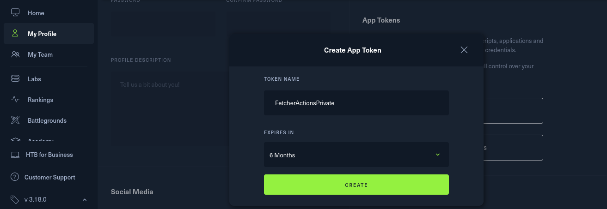
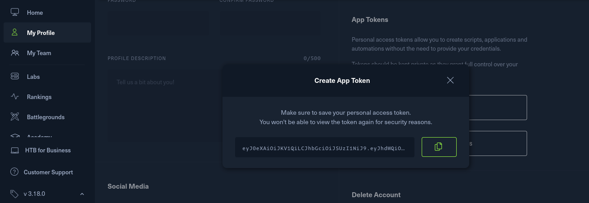
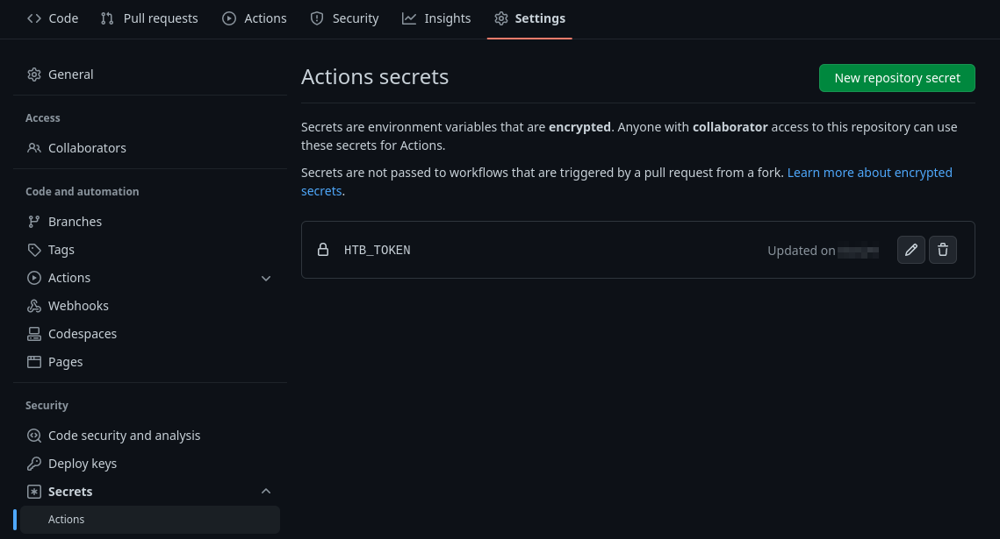

# HackTheBox WriteUps Auto-Fetcher

Automated Script with [Github actions](https://github.com/apps/github-actions) to fetch official [HackTheBox](https://www.hackthebox.com/) write-ups after the box is **retired**.

> **Warning**
> Please create a private repo to store the write-ups using `Use this template` button.

### Setup

1. Visit https://app.hackthebox.com/profile/settings
2. Scroll down to `App Tokens`.
3. Click on `CREATE APP TOKEN`.
4. Add `TOKEN NAME` = `FetcherActionsPrivate`.
5. Set `EXPIRES IN` = `6 Months` (or whicher you find suitable).
    > 
6. Copy the generated `APP TOKEN` and save it somewhere **safe**.
    > 
7. Add this token to `Actions secrets` at `https://github.com/<username>/htb-writeups-fetcher/settings/secrets/actions`
    > 
8. **Done**! Now on every Monday, 00:00 GMT this script will run which will pull the Official HTB write-ups for you and put it in [files](/files/) directory.
